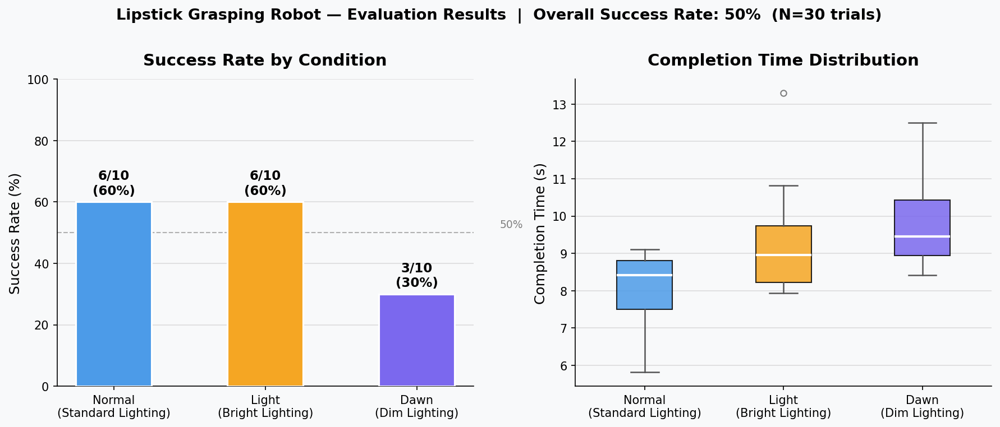
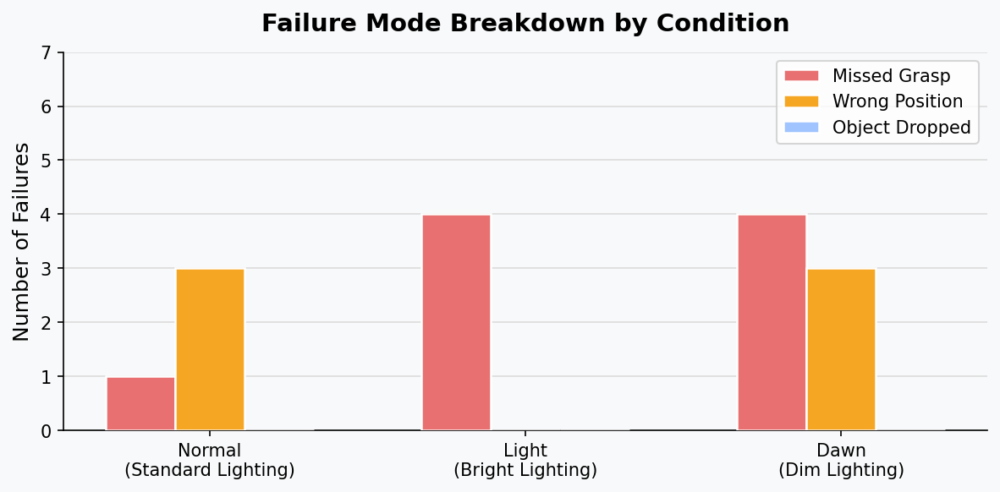

# Lipstick Grasping Robot

A bi-manual robotic system that autonomously picks up a lipstick from a cluttered surface and delivers it to a target location. Built with the SO-101 dual-arm robot using imitation learning (ACT policy) and YOLO-based visual attention.

**Video Demo:** [VIDEO_LINK_HERE]

**Team:** Shirley He, Yuhang, Elina Zhao

---

## Project Overview

We trained an ACT (Action Chunking with Transformers) policy on 365 human-demonstrated episodes of lipstick grasping. To improve generalization across object positions, we augmented training observations with YOLO-detected bounding box highlights that draw attention to the target object.

**Key components:**
- **ACT policy** — visuomotor policy trained via behavioral cloning
- **YOLO detector** — YOLOv8n fine-tuned to detect the lipstick and highlight it in training frames
- **Dataset pipeline** — merge, YOLO-highlight, and train scripts for end-to-end reproducibility
- **LeRobot framework** — built on [Hugging Face LeRobot](https://github.com/huggingface/lerobot)

---

## Quantitative Results

We evaluated over **30 trials** across three lighting conditions with the lipstick placed at the standard position.

| Condition | Success Rate | Avg. Completion Time |
|-----------|-------------|----------------------|
| Normal (standard lighting) | **6/10 (60%)** | 8.4 s |
| Light (bright lighting) | **6/10 (60%)** | 9.2 s |
| Dawn (dim lighting) | **3/10 (30%)** | 9.7 s |
| **Overall** | **15/30 (50%)** | — |

### Success Rate by Condition



### Failure Mode Breakdown



**Key findings:**
- The robot performs consistently under normal and bright lighting (60% each).
- Performance drops significantly under dim lighting (30%), suggesting the policy relies on visual contrast that degrades in low light.
- The most common failure mode is **missed grasp** — the gripper approaches the correct area but closes at a slightly wrong angle or offset.
- Raw trial data is in [`lerobot/evaluation/results/lipstick_eval.csv`](lerobot/evaluation/results/lipstick_eval.csv).

---

## Setup Instructions

### Requirements

- Ubuntu 22.04
- NVIDIA GPU with CUDA 12.4
- Docker with NVIDIA Container Toolkit
- VS Code with Dev Containers extension

### 1. Clone the repo

```bash
git clone --recursive https://github.com/GIXLabs/TECHIN517.git
cd TECHIN517
```

### 2. Open in Dev Container

In VS Code: **Ctrl+Shift+P** → `Dev Containers: Reopen in Container`

The container installs ROS 2 Humble, LeRobot, and all dependencies automatically.

### 3. Download pre-trained models

**ACT policy (main model):** [ShirleyGoose/lipstick-act-robot](https://huggingface.co/ShirleyGoose/lipstick-act-robot)

```bash
huggingface-cli download ShirleyGoose/lipstick-act-robot \
  --local-dir outputs/train/lipstick_act_yolo_highlight_final/checkpoints/100000/pretrained_model
```

**YOLO detector:** [ShirleyGoose/lipstick-yolo-detector](https://huggingface.co/ShirleyGoose/lipstick-yolo-detector)

```bash
huggingface-cli download ShirleyGoose/lipstick-yolo-detector \
  black_lipstick_yolo_weights.pt \
  --local-dir lipstick_yolo/models/black_lipstick_yolo/weights
mv lipstick_yolo/models/black_lipstick_yolo/weights/black_lipstick_yolo_weights.pt \
   lipstick_yolo/models/black_lipstick_yolo/weights/best.pt
```

---

## Usage Instructions

### Hardware setup

Connect the robot arms to USB:
Use `lerobot-find-port` & `lerobot-find-cameras opencv` to find the correct port. It changes every time.

**Example:**
- Left arm: `/dev/ttyACM3`
- Right arm: `/dev/ttyACM1`
- Wrist cameras: `/dev/video1` (left), `/dev/video10` (right)
- RealSense overhead camera

Verify motor connectivity:

```bash
python scan_motors.py
```

### Run the robot (inference)

```bash
bash evaluation/run_lipstick_policy.sh
```

### Collect new training data (teleoperation)

```bash
python lerobot/src/lerobot/scripts/lerobot_record.py \
  --config_path lerobot/teleop_with_cams.yaml \
  --dataset.repo_id=local/my_dataset \
  --dataset.root=datasets/local/my_dataset \
  --dataset.single_task="grasp the lipstick" \
  --dataset.num_episodes=10 \
  --dataset.episode_time_s=30
```

### Retrain from scratch

```bash
# Step 1: Merge datasets
python merge_datasets.py

# Step 2–5: YOLO highlight + train YOLO detector
bash run_pipeline.sh

# Step 6: Train ACT policy
bash lerobot/train_act.sh   # see script for full config
```

### Run evaluation

```bash
# Terminal A — run the policy
bash evaluation/run_lipstick_policy.sh

# Terminal B — log results
python evaluation/log_lipstick_eval.py \
  --states normal light dawn \
  --trials-per-state 10 \
  --timeout-s 30 \
  --csv evaluation/results/lipstick_eval.csv \
  --home-command "python evaluation/move_to_home.py \
    --robot.type=bi_so_follower --robot.id=bi_follower \
    --robot.left_arm_config.port=/dev/ttyACM3 \
    --robot.right_arm_config.port=/dev/ttyACM1 \
    --home_pose_path=configs/home_pose.json \
    --duration_s=3"
```

---

## Repository Structure

```
├── .devcontainer/          # VS Code Dev Container config
├── docker/                 # Dockerfile and setup scripts
├── evaluation/             # Custom evaluation scripts and results
│   ├── log_lipstick_eval.py       # Manual trial logger (policy in separate terminal)
│   ├── run_lipstick_eval.py       # Automated evaluation controller
│   ├── move_to_home.py            # Reset robot to home pose
│   ├── run_lipstick_policy.sh     # Single-inference runner
│   ├── eval_with_cams.yaml        # Evaluation camera config
│   └── results/
│       └── lipstick_eval.csv      # Raw trial data (30 trials)
├── configs/                # Robot and camera configuration
│   ├── teleop_with_cams.yaml
│   ├── robot_client_config.yaml
│   └── home_pose.json
├── lipstick_yolo/          # YOLO detector pipeline
│   └── scripts/            # Dataset prep, highlight, and extract scripts
├── results/                # Quantitative result charts (PNG)
├── merge_datasets.py       # Merge multiple recording batches
├── merge_yolo_highlight_datasets.py
├── run_pipeline.sh         # End-to-end train pipeline
├── eval_trials.py          # Standalone trial recorder
└── scan_motors.py          # Motor connectivity check
```

---

## Acknowledgements

- [LeRobot by Hugging Face](https://github.com/huggingface/lerobot) — robot learning framework
- [Ultralytics YOLOv8](https://github.com/ultralytics/ultralytics) — object detection
- [SO101 manual by Hugging Face](https://huggingface.co/docs/lerobot/en/so101) — robot hardware guide
- [feetech_ros2_driver by JafarAbdi](https://github.com/JafarAbdi/feetech_ros2_driver)
- UW GIX TECHIN 517 teaching team
